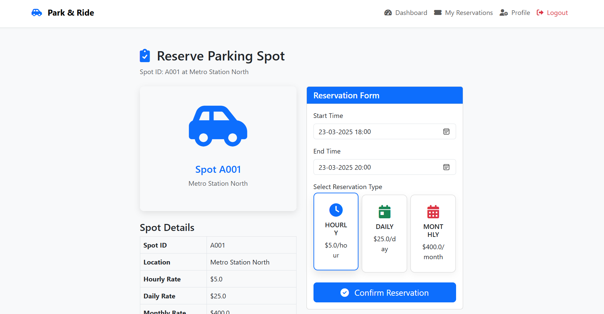
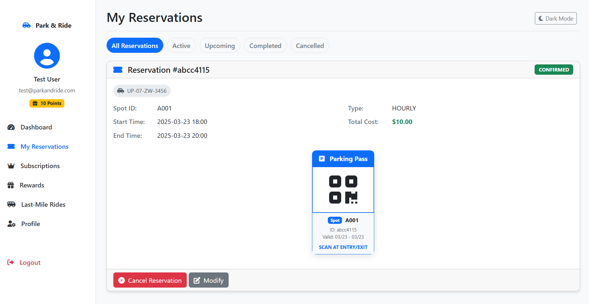
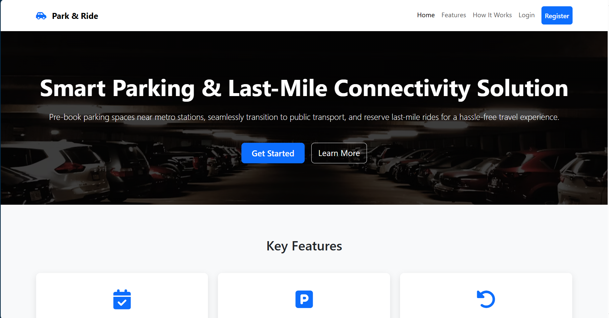
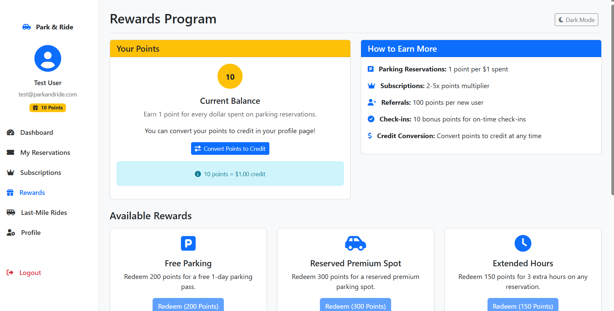
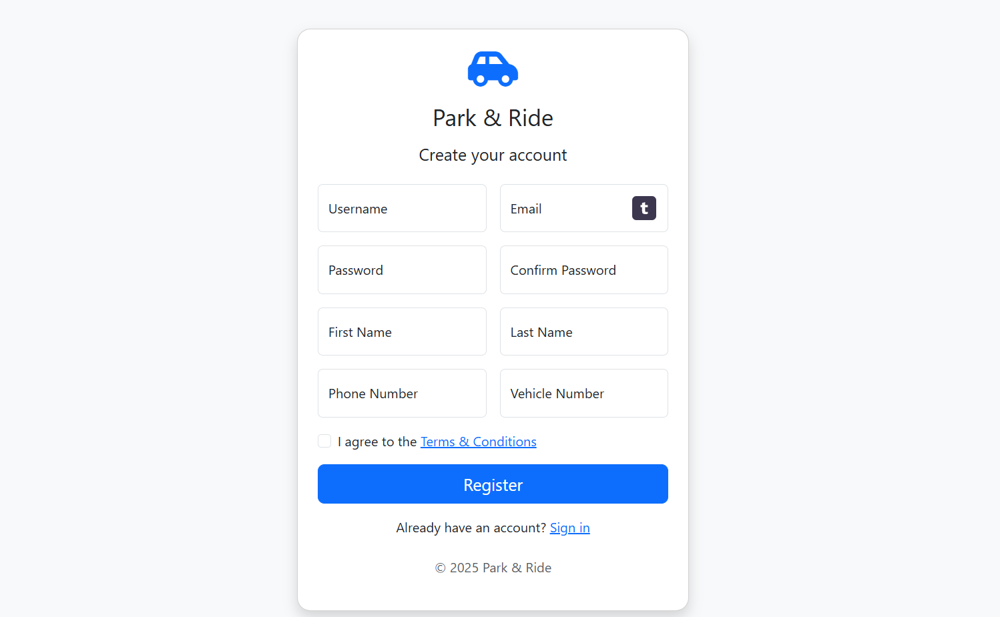
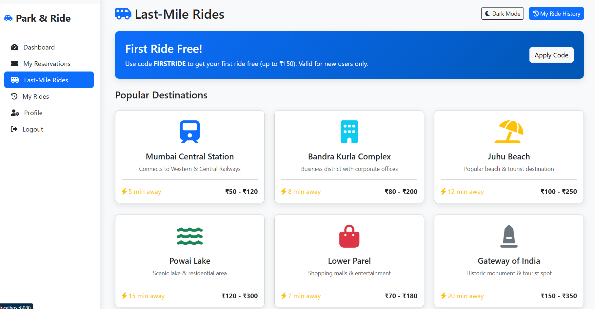
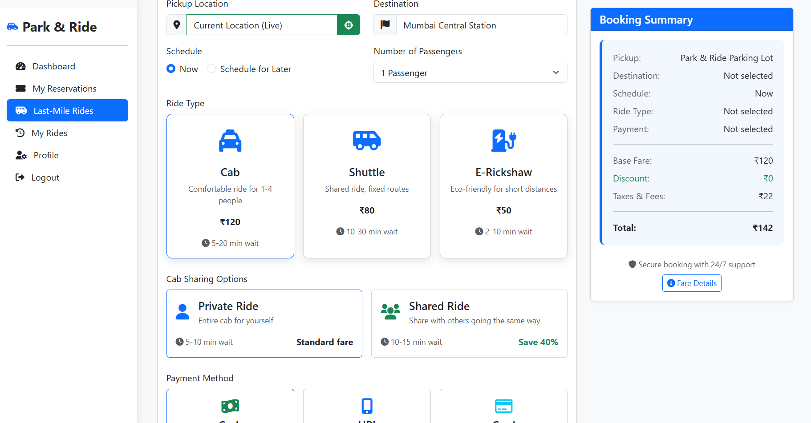

# Park & Ride: Smart Urban Mobility System

![Park and Ride Logo]

## About Park & Ride

Park & Ride is a comprehensive urban mobility solution designed to simplify commuting in congested metropolitan areas. The platform combines efficient parking management with last-mile transportation options, creating a seamless travel experience. Our integrated approach helps reduce traffic congestion, minimize environmental impact, and provide convenience to daily commuters.

## 🌟 Key Features

### 🅿️ Smart Parking Management
- **Real-time parking availability** tracking across multiple locations
- **Reservation system** for guaranteed parking spots
- **Flexible booking options** with hourly, daily, and monthly plans
- **Automated entry/exit** using digital tokens

### 🚗 Last-Mile Ride Services
- **Variety of transportation options** including cabs, shuttles, and e-rickshaws
- **Ride sharing** functionality for cost-effective travel
- **Popular destinations** with one-click booking
- **Live location** tracking for pickup and drop-off

### 👤 User-Centric Features
- **Personalized dashboard** with booking history and statistics
- **Reward points system** for loyal customers
- **Easy cancellation and refund** processing
- **Dark/Light mode** for comfortable viewing

## 📸 Screenshots

### Home & Dashboard

*The main dashboard provides at-a-glance information about reservations, rewards, and last-mile rides.*

### Parking Reservation

*The intuitive parking reservation form with date/time selection and flexible booking options.*


*View and manage your active, upcoming, and past reservations with easy access to parking passes.*

### Last-Mile Rides

*Browse popular destinations with pricing information and quick-booking options.*


*Choose from multiple transportation options including cabs, shuttles, and e-rickshaws with real-time pricing.*

### User Account

*Manage your personal information and vehicle details in the user profile section.*


*Earn and redeem points through our comprehensive rewards program.*

### Authentication

*Easy and secure registration process for new users.*

## 🔧 Installation & Setup

```bash
# Clone the repository
git clone https://github.com/amberIS01/Park-and-Ride-Project.git

# Navigate to the project directory
cd Park-and-Ride_Project

# Install dependencies
mvn install

# Run the application
mvn spring-boot:run
```

The application will be available at `http://localhost:8080`

## 💻 Technologies Used

- **Backend:** Java, Spring Boot, Spring Security, Spring Data JPA
- **Frontend:** Thymeleaf, HTML5, CSS3, JavaScript, Bootstrap 5
- **Database:** MySQL/H2 Database
- **Build Tool:** Maven
- **Authentication:** Spring Security with custom user details service
- **Maps Integration:** Leaflet.js, OpenStreetMap API

## 👨‍💻 Contributing

We welcome contributions to the Park & Ride project! Please follow these steps:

1. Fork the repository
2. Create a feature branch (`git checkout -b feature/your-feature-name`)
3. Commit your changes (`git commit -m 'Add some feature'`)
4. Push to the branch (`git push origin feature/your-feature-name`)
5. Open a Pull Request

## 📝 Recommended Screenshots

For the README, the following screenshots would be most effective:

1. **Dashboard Overview** - Shows the main dashboard with reservation statistics and quick actions
2. **Parking Reservation Form** - Highlights the intuitive booking interface
3. **My Reservations Page** - Demonstrates how users can view and manage their bookings
4. **Last-Mile Rides Interface** - Showcases the ride booking process with destination options
5. **Popular Destinations** - Highlights the one-click booking for common locations
6. **Ride Booking Confirmation** - Shows the confirmation modal with ride details
7. **Dark Mode View** - Demonstrates the application's dark mode functionality

## 📄 License

This project is licensed under the MIT License - see the [LICENSE](LICENSE) file for details.

## 🙏 Acknowledgments

- Icons provided by [Font Awesome](https://fontawesome.com/)
- Bootstrap themes and components
- Open source community for invaluable resources and inspiration

---

Developed with ❤️ by Aryan Sinha
